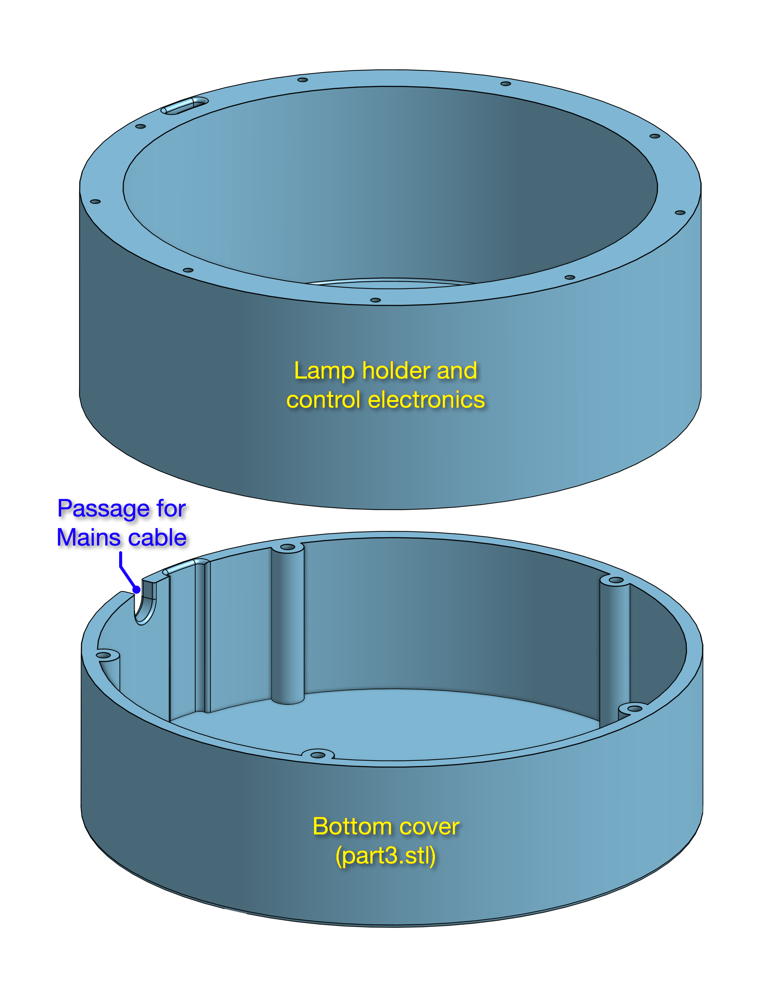
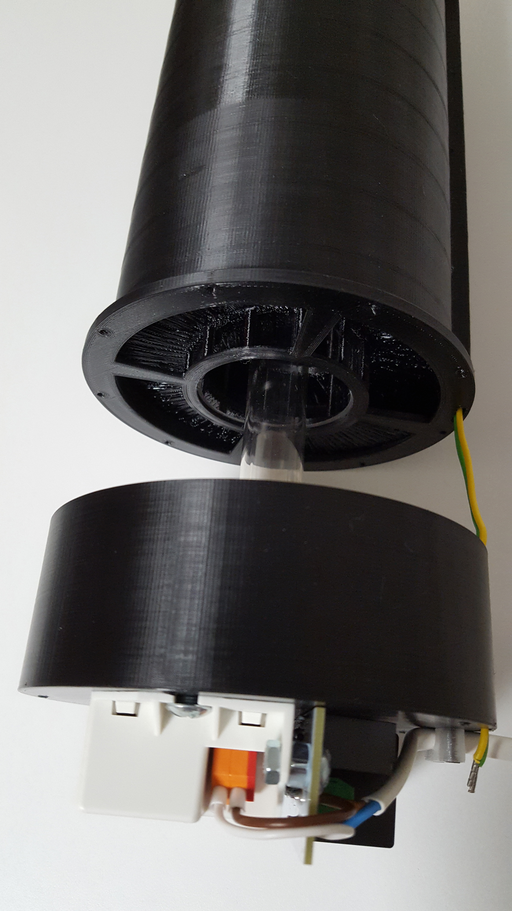
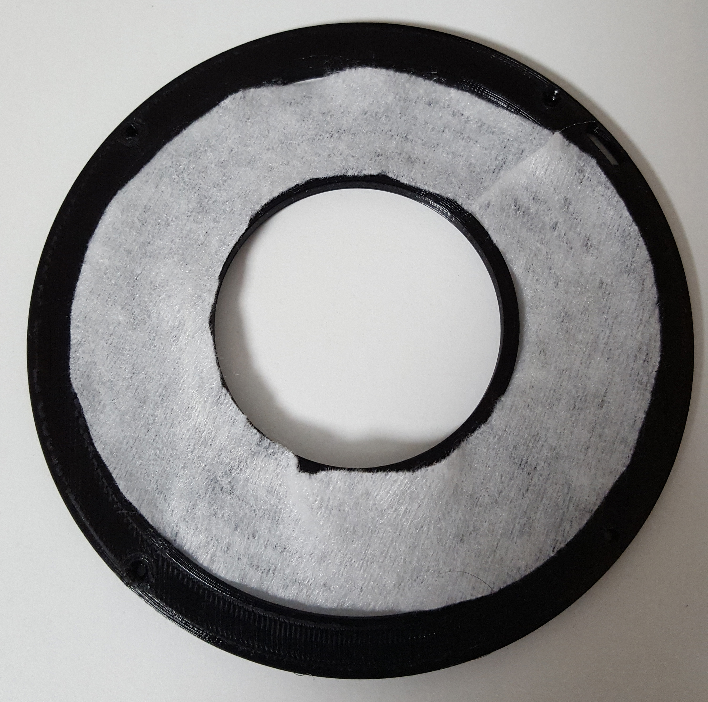

# ECoS-19

***Effective Covid-19 Sterilizer that anyone can build with a 3D printer***
  

<b>This project has been included by the European Community in the "Digital Response to COVID-19" database managed by the European Commission DIGIT. <a href="https://joinup.ec.europa.eu/collection/digital-response-covid-19/open-source-solutions#Open%20Source%20Hardware">This is the link.</a>
  
FILOALFA® by Ciceri de Mondel cooperated in producing a special filament by adding anti-UVC rays protection to PETG. For more information please find the following <a href="https://www.filoalfa3d.com">link</a> and <a href="mailto:info@filoalfa3d.com">contact</a>.
</b>

 

 
 
  

***Introduction***
 

These days there is a lot of talk about the effectiveness of ultraviolet rays (UVC) for the sterilization of air and surfaces against Covid-19 contamination. However, almost all the discussions lack solid scientific bases because Covid-19 still has little understood aspects.  
Now things have changed and we can find good scientific papers on the effectiveness of sterilization of Covid-19 with UVC rays.
Scientists studied the effectiveness of UVC irradiation of Covid-19 virus cultures in the laboratory and published the results including the UVC energies required to ensure complete destruction of the virus at various concentrations.  
In the scientific paper "<b><i>UV-C irradiation is highly effective in inactivating and inhibiting SARS-CoV-2 replication</b></i>", which can be found at the following <a href="https://www.researchgate.net/publication/341996345_UV-C_irradiation_is_highly_effective_in_inactivating_and_inhibiting_SARS-CoV-2_replication">link</a>, it has been shown that an energy equal to 3.7 mJ/cm2 at a wavelength of 254 nm is sufficient for 3-log inactivation (99.9%, see <a href="https://en.wikipedia.org/wiki/Log_reduction">link</a>) of Covid-19 and that an energy of 16.9 mJ/cm2 completely inhibits any concentration of the virus. 
The same results are shown in the scientific review paper "<b><i>Ultraviolet irradiation doses for coronavirus inactivation - review and analysis of coronavirus photoinactivation studies</b></i>" which can be found at the following <a href="https://www.ncbi.nlm.nih.gov/pmc/articles/PMC7273323">link</a>. 
The problem is that the majority of consumer products for the air sterilization of the rooms do not reach these energy levels because the consumer products are not able to guarantee an air crossing time in the UVC lamp long enough to obtain the energy values reported in the scientific results.  

***Disclaimer***

The device described in this project is experimental and has not been subjected to health safety tests and certification procedures. 
UVC radiation can cause severe burns of the skin and eye injuries. Avoid direct skin exposure to UVC radiation and never look directly into a UVC light source, even briefly. 
It is recommended to set the correct 3D printing parameters for the special PETG filament used in this project, as indicated in the following instructions. 
Whoever builds and uses the device described assumes the resulting risks.  

***The project***

This is the design of a device that anyone can make using a 3D printer and a special PETG filament protected with a UVC additive. You can find the 3D STL models of the device in the file section. All 3D STL models supplied can be printed without the need for supports.  
The project allows to obtain the UVC energy levels required for the sterilization of Covid-19 because it provides a <b>spiral shaped air path around the UVC lamp</b> and a subsequent path along the axis of the lamp, obtaining a long travel time and also the necessary cooling of the lamp.  

  

The diameter of the cylinder is 10 cm and the height 20 cm. The internal cylinder that houses the lamp has a diameter of 5 cm. The air path consists of 10 turns of rectangular section 2.5x2 cm and therefore the median path of the air is 235 cm long. To this length must also be added the return path of the air along the lamp which is equal to 20 cm, therefore the total path of the air is equal to 255 cm. 
With an air flow speed of 1 m/s, the air remains in the device for 2.55 sec. 
A Philips TUV PL-L UVC lamp with a length of 20 cm and 18 W of power generates 5.5 W of light power at a wavelength of 254 nm, the radiation produced on the surface of the lamp is equal to 25 mW/cm2 and therefore 17.5 mW/cm2 on the surface of the internal cylinder. The vertical cylindrical supports and the spiral reduce by 34.5% the surface of the internal cylinder exposed to the air flow, so the air moving at 1 m/s receives in the median path a UVC dose of 19.5 mJ/cm2, which is 1.15 times greater than the maximum reported in the scientific paper. These values can optionally be further doubled by using the HO (High Output) version of the same Philips lamp which provides double the output power while maintaining the same mechanical dimensions. <b>This definitively ensures the effectiveness of sterilization.</b>  
The internal wall of the cylinder cannot be printed because, if made of plastic, even if thin, it does not allow the transmission of UVC rays, therefore it is necessary to use a quartz cylinder (diameter 5 cm) inserted inside the device as shown in the figures.

 
 
 
  

***The special filament for 3D printing***

FILOALFA® has produced for this project a special filament for 3D printing that contains an additive that protects PETG from degradation caused by UVC rays. The additive absorbs the energy of UVC rays and re-emits light in the infrared spectrum that does not damage the PETG and heat that is dissipated by the air flow.

 

The following two photos were taken with a webcam to which the infrared filter was removed in order to see the infrared radiation emitted by the additive present in the plastic. Since the plastic of the filament is also transparent to infrared rays, it is possible to see the internal structures of the device in transparency. The first photo was taken with the room light on and the second in the dark.

 

The following are the thermal images of the device in operation. The last shows the heat produced by the electronics in the base of the device.

 
 
  

As already mentioned, the spiral path of the air allows to obtain the energy levels required for sterilization. 
The <a href="https://www.youtube.com/watch?v=gAzGqoRCgeE">following video</a> shows a rough check of the time it takes for air to pass through the device. 
An alcohol sensor and an alcohol-soaked absorbent sheet are used. 
Initially, the absorbent sheet is brought close to the sensor directly in the outlet air flow to check the response speed of the sensor. The absorbent sheet is then brought close to the air inlet of the ECoS-19 device to check the time that the air takes to pass through it.
  

***Make the device***

To make the device it is possible to use a 3D printer even inexpensive. The printing parameters are as follows: 
- Spiral cylinder (part1.stl): special filament, temperature 240°C, printing bed 85°C, speed max 50mm/s, infill 100%, no supports, recommended to use Dimafix print bed adhesive. 
- Lamp and control electronics holder (part2.stl): special filament, temperature 240°C, printing bed 85°C, speed max 80mm/s, gyroid infill 10%, no supports. 
- Bottom cover (part3.stl): you can use a PLA filament of your favorite color because it is not affected by UVC rays. 
- Mains cable clamp (part4.stl): you can use a PLA filament of your favorite color because it is not affected by UVC rays. 
- Dust filter holder (part5.stl): special filament, temperature 240°C, printing bed 85°C, speed max 80mm/s, infill 100%, no supports. 
- Fan holder (part6.stl): special filament, temperature 240°C, printing bed 85°C, speed max 80mm/s, infill 100%, no supports. 
- Flange (part7.stl): special filament, temperature 240°C, printing bed 85°C, speed max 50mm/s, infill 100%, no supports. 
- Optional graphic of the virus (top_piece.stl): you can use a PLA filament of your favorite color because it is not affected by UVC rays.

  

***Assembly***

The UVC lamp is housed in a section that contains the socket and the ballast with the control electronics. The complete design of the electronic card is described below.

 
 
 
 
 

The spiral cylinder is fixed to the base with 9x M2 self-tapping screws.

 

The quartz cylinder is connected at the top to a flange that contains a fan which, sucking the air, creates the spiral flow around the lamp and along the lamp itself. 
The total pressure loss in the air path is 11 mmH2O. This data allowed us to choose the correct fan that guarantees a minimum air flow speed of 2 m/s. It is a blower produced by Delta Fan model BFB04512VHD. 
The blue wire of the fan is not used and should be left unconnected. Only the red and black wires (Fan+ and Fan-) must be connected to the electronic board.

 
 
 
 

Between the top of the cylinder and the flange connection there is a filter holder on which to insert a ring prefilter to prevent dust from entering the device. The filter shape is a ring cut to be inserted into the housing without disassembling the flange. The inner diameter of the ring is 56 mm, the outer diameter is 96 mm and the maximum filter thickness is 5 mm. You can find a PDF template of the filter in the "assembly" folder. To match the 2 m/s air speed of the device, the pressure drop of the chosen filter must be equal to 2 mmH2O.

 
 
 

In the next two figures you can see the complete device and the sectional view.

 

 
The device includes an electronic circuit that controls the operation of the fan. If the rotation speed is reduced too much or the fan stops, the circuit switches off the UVC lamp to avoid overheating. In the files section you can find the schematic and gerber files of the printed circuit. 
The electronic circuit is fixed with screws to the electronic ballast of the UVC lamp and mounted in the base of the device.
  

 

 

